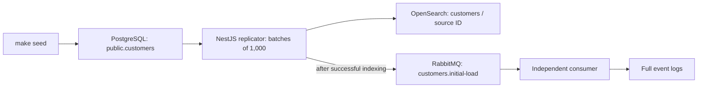

# v0 walkthrough and catch-up — 27 September 2026

## Current status

The complete v0 initial-load path has now been run from fresh Docker volumes and manually inspected: **10,000 source rows, 10,000 OpenSearch documents, and 10,000 consumer event log lines**. The replicator completed ten bounded batches and exited 0. Records 1, 1000, 1001, and 10000 matched across source, index, and consumer logs.

The implementation was merged in [PR #12](https://github.com/tmspacechimp/kill-it-twice/pull/12), covering issues #6–#10. The follow-up review and live run found no application defect requiring a code change. The documentation now records the completed run.

## What the system does



The replicator waits for seeded data, reads a read-only snapshot, and processes records sequentially. For each record it awaits the OpenSearch write, then publishes the event and awaits broker confirmation. After the initial snapshot is exhausted it exits. The consumer remains subscribed.

PostgreSQL is a client-like source, not an application state store. The public schema contained only the customers table after the run.

## Run the same walkthrough

Open WSL, ensure Docker is running, and change to the repository root. Configure the existing `.env` with local passwords as described in [README](../README.md). Use standalone `docker-compose`, which is also what the Makefile invokes.

For the verified run, these environment variables selected a new project and unused ports:

```sh
export COMPOSE_PROJECT_NAME=v0-verified
export POSTGRES_PORT=25432 OPENSEARCH_PORT=29200
export RABBITMQ_PORT=25673 RABBITMQ_MANAGEMENT_PORT=25674
docker-compose up --build -d
make seed
timeout 240 docker wait v0-verified_replicator_1
docker-compose logs --no-color --tail=12 replicator
docker-compose ps -a
```

The `v0-verified` project is now populated and left running for inspection, with the replicator exited. For another clean start, choose a new project name and unused ports and adjust the name passed to `docker wait`. Existing volumes do not need to be deleted.

To explicitly watch seed readiness on a fresh source, follow the replicator logs before running `make seed`; wait for `Waiting for seeded records in public.customers`. The completed run above seeded immediately after startup; its logs showed processing rather than a waiting interval.

The actual seed inserted 10,000 rows. Final logs were:

```text
Batch 9: rows=1000 firstId=8001 lastId=9000 total=9000
Batch 10: rows=1000 firstId=9001 lastId=10000 total=10000
Initial load complete: rows=10000 batches=10
```

`docker wait` printed `0`. PostgreSQL, OpenSearch, and RabbitMQ were healthy; the consumer was still running.

## Follow a record through all three systems

Keep the same exported environment in the WSL shell:

```sh
docker-compose exec -T postgres psql -X -U source -d client_source -c "SELECT * FROM public.customers WHERE id IN (1,1000,1001,10000) ORDER BY id;"
docker-compose exec -T opensearch curl --fail --silent http://localhost:9200/customers/_doc/10000
docker-compose logs --no-color consumer | grep '"sourceId":10000,'
```

All six fields matched for each of the four inspected IDs. For the last record:

| Field | Observed value |
| --- | --- |
| id | 10000 |
| full_name | Customer 10000 |
| email | customer10000@example.test |
| country_code | FR |
| status | inactive |
| created_at | 2025-01-07 22:40:00 UTC |

OpenSearch reported `_id: "10000"`, `found: true`, and the same fields in `_source`. JSON timestamps use ISO UTC format. The consumer logged:

```json
{"type":"customer.initial-load","sourceId":10000,"record":{"id":10000,"full_name":"Customer 10000","email":"customer10000@example.test","country_code":"FR","status":"inactive","created_at":"2025-01-07T22:40:00.000Z"}}
```

The first-batch boundary was also checked: source IDs 1000 and 1001 both had matching documents and events.

## Counts and checks

```sh
docker-compose exec -T opensearch curl --fail --silent http://localhost:9200/customers/_count
docker-compose logs --no-color consumer | grep -c 'Received event '
docker-compose exec -T rabbitmq rabbitmqctl list_queues name messages_ready messages_unacknowledged consumers
```

Observed: 10,000 documents, 10,000 event log lines, and queue `customers.initial-load` with 0 ready messages, 0 unacknowledged messages, and 1 consumer. Source aggregation returned 10,000 rows, 10,000 distinct IDs, minimum 1, maximum 10000.

The load ran from 11:59:53 to 12:01:44 UTC. Both Docker images built successfully. The focused replicator suite passed all 12 tests, and the consumer TypeScript build passed:

```sh
npm test --prefix apps/replicator
npm run build --prefix apps/consumer
```

These results are happy-path observations and focused unit checks, not failure-gate guarantees. The [README validation record](../README.md#actual-validation--2026-09-27) contains the full commands and evidence.

## Implementation choices

| Area | Decision |
| --- | --- |
| Source reads | One read-only, repeatable-read snapshot; at most 1,000 rows per query. |
| Batch boundary | First query orders by ID without a lower bound; later queries use `WHERE id > lastId ORDER BY id LIMIT 1000`. |
| OpenSearch | Index `customers`, source ID as document ID, six-field JSON body, default dynamic mapping. |
| RabbitMQ | Queue `customers.initial-load`; non-durable queue, non-persistent events, one confirmed publication at a time. |
| Consumer | Separate TypeScript process, full event logs, automatic acknowledgement. |
| Completion | Replicator exits; consumer stays subscribed. Later source changes are not watched. |

See [SPEC](../SPEC.md) for the behavior contract.

## Limits and next work

This version has no incremental sync, checkpoints, recovery, retries, DLQ, receipt storage, UI, or automated failure-gate checks. Restarting the replicator repeats the snapshot and can publish duplicates. Indexing and publication are separate operations; automatic acknowledgement can lose an event before its log is written. Stale index documents are not removed.

The happy-path walkthrough is complete. Further development should begin with a new specification decision for the next capability from the [broader assignment](project-brief-en.md).

## Code map

- [Workflow](../apps/replicator/src/initial-load.service.ts): seed waiting, batch processing, progress, and source lifecycle.
- [Source reader](../apps/replicator/src/customer-source.service.ts): PostgreSQL connection, snapshot commands, and bounded queries.
- [Customer type](../apps/replicator/src/customer.ts): record shape shared by source and destinations.
- [Replicator entry point](../apps/replicator/src/main.ts): index-then-publish ordering and cleanup.
- [Indexer](../apps/replicator/src/indexer.service.ts): OpenSearch writes.
- [Publisher](../apps/replicator/src/publisher.service.ts): RabbitMQ events and confirms.
- [Consumer](../apps/consumer/src/main.ts): subscription and logging.
- [Compose](../compose.yaml): service configuration and readiness.
